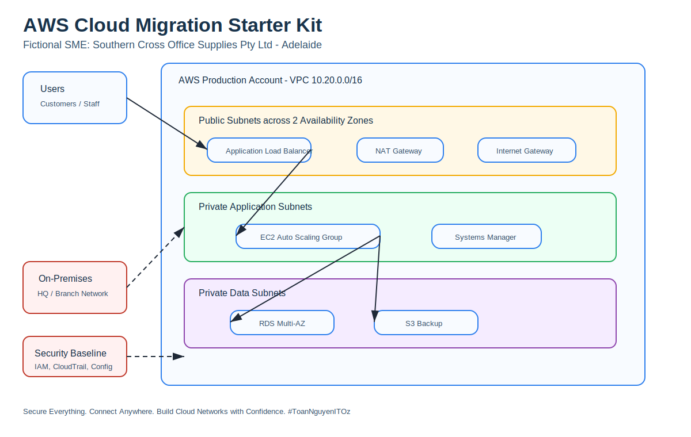
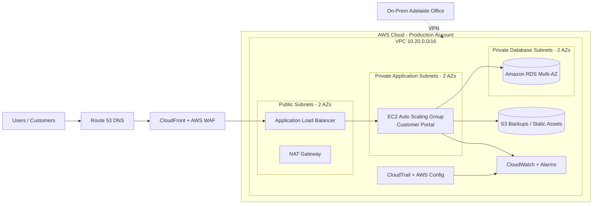

<a id="top"></a>

# ☁️ AWS Cloud Migration Starter Kit for SMEs



> A practical, portfolio-ready AWS cloud fundamentals and migration repository for a simulated Australian small business moving from on-premises infrastructure to AWS.

---

## Repository Purpose

This repository is designed for **IT Support**, **System Administration**, **Junior Cloud**, and **Cloud Support** candidates who want to demonstrate real-world cloud migration thinking.

It explains how a small business can plan, design, build, secure, monitor, and operate a basic AWS cloud environment.

The project covers:

- Cloud computing fundamentals
- AWS core services and common use cases
- Business-driven cloud migration planning
- On-premises environment assessment
- Target AWS architecture design
- VPC, public subnets, private application subnets, and private database subnets
- Internet Gateway, NAT Gateway, route tables, and DNS basics
- IAM roles, least privilege access, MFA, and account safety
- EC2 web servers, Application Load Balancer, Launch Template, and Auto Scaling Group
- Amazon RDS private database setup
- Amazon S3 private storage, backup folder structure, encryption, versioning, and lifecycle rules
- CloudWatch monitoring, alarms, and operational checks
- Backup, disaster recovery, cutover, rollback, and troubleshooting runbooks
- **Manual AWS Management Console setup without relying on scripts**
- Script examples, Terraform examples, and CloudFormation examples for repeatable deployment

---

## Simulated Business Scenario

**Company:** Southern Cross Office Supplies Pty Ltd  
**Location:** Adelaide, South Australia  
**Industry:** Retail and wholesale office supplies  
**Size:** 48 staff, 3 locations, 2 internal IT staff  
**Current Environment:** Small on-premises server room with Windows Server, file shares, customer portal, local database, backup NAS, VPN, and ageing hardware.

The business wants to move selected services to AWS to improve:

- Availability
- Security
- Remote access
- Backup and disaster recovery
- Scalability during seasonal order spikes
- Cost visibility
- IT operational efficiency

Read the full scenario here: [Business Scenario](docs/business/scenario.md)

For the infographic-style learning page, see: [AWS Cloud Migration Deep Dive](docs/infographic/aws-cloud-migration-deep-dive.md)

---

## Target AWS Architecture



Detailed design: [Target Architecture](docs/architecture/target-architecture.md)

---

## Repository Structure

```text
aws-cloud-migration-starter-kit-sme/
├── README.md
├── README-VI.md
├── AUTHOR.md
├── assets/
│   └── aws-cloud-migration-overview.svg
├── docs/
│   ├── infographic/
│   ├── business/
│   ├── cloud-basics/
│   ├── architecture/
│   ├── migration/
│   ├── setup/
│   │   ├── 01-account-landing-zone.md
│   │   ├── 02-iam-security.md
│   │   ├── 03-network-vpc.md
│   │   ├── 04-compute-alb-asg.md
│   │   ├── 05-rds-s3.md
│   │   ├── 06-monitoring-backup.md
│   │   ├── 07-hybrid-dns.md
│   │   ├── 08-end-to-end-hands-on-lab.md
│   │   ├── 09-aws-console-manual-setup.md
│   │   └── 10-aws-console-build-checklist.md
│   ├── security/
│   ├── operations/
│   ├── cost/
│   ├── runbooks/
│   ├── interview/
│   └── revision/
├── iac/
│   ├── terraform/
│   └── cloudformation/
├── sample-app/
├── scripts/
└── templates/
```

---

## Learning Path

| Step | Topic | Document |
|---|---|---|
| 1 | Cloud foundation | [Core Concepts](docs/cloud-basics/core-concepts.md) |
| 2 | Business context | [Business Scenario](docs/business/scenario.md) |
| 3 | Migration assessment | [Assessment Workbook](docs/migration/assessment-workbook.md) |
| 4 | Target design | [Target Architecture](docs/architecture/target-architecture.md) |
| 5 | AWS foundation setup | [Account & Landing Zone](docs/setup/01-account-landing-zone.md) |
| 6 | Identity & access | [IAM & Security Setup](docs/setup/02-iam-security.md) |
| 7 | Network setup | [VPC Setup](docs/setup/03-network-vpc.md) |
| 8 | Compute setup | [ALB & Auto Scaling](docs/setup/04-compute-alb-asg.md) |
| 9 | Data setup | [RDS & S3](docs/setup/05-rds-s3.md) |
| 10 | Monitoring | [Monitoring & Backup](docs/setup/06-monitoring-backup.md) |
| 11 | End-to-end setup overview | [Hands-On Lab](docs/setup/08-end-to-end-hands-on-lab.md) |
| 12 | Manual AWS Console setup | [AWS Console Manual Setup Guide](docs/setup/09-aws-console-manual-setup.md) |
| 13 | Manual build evidence checklist | [AWS Console Build Checklist](docs/setup/10-aws-console-build-checklist.md) |
| 14 | Migration execution | [Migration Roadmap](docs/migration/migration-roadmap.md) |
| 15 | Operations | [Operational Checklist](docs/operations/operational-checklist.md) |
| 16 | Troubleshooting | [Troubleshooting Guide](docs/runbooks/troubleshooting-guide.md) |
| 17 | Interview prep | [Cloud Interview Questions](docs/interview/cloud-interview-questions.md) |

---

## Deployment Options

This repository supports **three ways** to build the lab.

| Option | Best For | Main Folder / File |
|---|---|---|
| **Option A - Manual AWS Console** | Beginners, IT Support portfolio, interview preparation | [docs/setup/09-aws-console-manual-setup.md](docs/setup/09-aws-console-manual-setup.md) |
| **Option B - Scripts** | Quick testing and repeatable small tasks | [scripts/](scripts/) |
| **Option C - Infrastructure as Code** | Cloud/DevOps practice and repeatable deployments | [iac/terraform/](iac/terraform/) and [iac/cloudformation/](iac/cloudformation/) |

Recommended learning order:

1. Read the business scenario.
2. Build manually in the AWS Console to understand every component.
3. Repeat selected tasks using scripts.
4. Rebuild the foundation using Terraform or CloudFormation.
5. Compare manual configuration with Infrastructure as Code.
6. Document screenshots, issues, troubleshooting steps, and lessons learned.

---

## Manual AWS Console Configuration Guide

This repo now includes a full click-by-click guide for learners who want to configure the environment **directly in the AWS Management Console**, not only by scripts.

Start here:

[Manual AWS Console Setup Guide](docs/setup/09-aws-console-manual-setup.md)

Use this checklist while building:

[AWS Console Build Checklist](docs/setup/10-aws-console-build-checklist.md)

### Manual Build Order

| Phase | AWS Service | What You Configure |
|---|---|---|
| 1 | Account / Billing | Region, MFA, budget alerts, project tags |
| 2 | VPC | VPC `10.20.0.0/16`, DNS hostnames, DNS resolution |
| 3 | Subnets | 2 public, 2 private app, 2 private DB subnets across 2 AZs |
| 4 | Internet Gateway | Public internet path for public subnets |
| 5 | NAT Gateway | Outbound internet access for private app instances |
| 6 | Route Tables | Public route to IGW, app route to NAT, DB route local only |
| 7 | Security Groups | ALB SG, App SG, RDS SG with least privilege rules |
| 8 | IAM | EC2 role for SSM, CloudWatch, and limited S3 access |
| 9 | S3 | Private bucket, encryption, versioning, lifecycle rules |
| 10 | RDS | Private MySQL/MariaDB database in DB subnet group |
| 11 | EC2 Builder | Temporary web server to test app and RDS connectivity |
| 12 | AMI / Launch Template | Golden image or user-data based app deployment |
| 13 | Target Group | HTTP target group with `/health.html` health check |
| 14 | ALB | Internet-facing ALB in public subnets |
| 15 | Auto Scaling Group | Private EC2 instances across two AZs, desired/min/max capacity |
| 16 | CloudWatch | Metrics, alarms, logs, and basic operations dashboard |
| 17 | Backup | RDS automated backup, snapshots, S3 protection, optional AWS Backup |
| 18 | Validation | ALB DNS test, target health, RDS query, S3 upload, alarm check |
| 19 | Cutover Simulation | Test DNS or local hosts file pointing to ALB |
| 20 | Cleanup | Delete resources in correct dependency order to avoid charges |

### Suggested Manual Lab Values

| Item | Value |
|---|---|
| Region | `ap-southeast-2` Sydney |
| VPC CIDR | `10.20.0.0/16` |
| Public Subnet A | `10.20.0.0/24` |
| Public Subnet B | `10.20.1.0/24` |
| Private App Subnet A | `10.20.10.0/24` |
| Private App Subnet B | `10.20.11.0/24` |
| Private DB Subnet A | `10.20.20.0/24` |
| Private DB Subnet B | `10.20.21.0/24` |
| ALB Listener | HTTP 80 for lab, HTTPS 443 for production-style design |
| App Port | HTTP 80 |
| DB Port | MySQL/MariaDB 3306 |
| ASG Desired / Min / Max | 2 / 2 / 4 |
| Health Check Path | `/health.html` |

### Manual Security Group Model

| Security Group | Inbound Rule | Source |
|---|---|---|
| `scos-dev-alb-sg` | HTTP 80 / HTTPS 443 | Internet or trusted IP range |
| `scos-dev-app-sg` | HTTP 80 | `scos-dev-alb-sg` only |
| `scos-dev-rds-sg` | MySQL 3306 | `scos-dev-app-sg` only |

Preferred admin access method:

```text
Use AWS Systems Manager Session Manager instead of opening SSH to the internet.
```

Temporary lab SSH access, if required:

```text
Allow TCP 22 only from your own public IP address, then remove the rule after testing.
```

### Manual Validation Checklist

After the manual build, confirm:

- VPC and all six subnets exist.
- Public subnets have a route to the Internet Gateway.
- Private app subnets have outbound internet through the NAT Gateway.
- Private DB subnets do not have a default internet route.
- ALB is internet-facing and placed in public subnets.
- EC2 app instances run in private app subnets.
- RDS is private and not publicly accessible.
- Target group shows healthy instances.
- ALB DNS loads the sample web page.
- App can connect to RDS using the private endpoint.
- S3 bucket blocks public access and has encryption enabled.
- CloudWatch alarms are created.
- Budget alert is configured.
- Cleanup plan is documented.

---

## Hands-On Build Summary

The core lab builds:

- One VPC across two Availability Zones
- Public subnets for ALB and NAT Gateway
- Private application subnets for EC2 Auto Scaling
- Private database subnets for RDS
- Internet Gateway and NAT Gateway routing
- Security Groups using least privilege
- Application Load Balancer
- Target Group and health checks
- Launch Template and Auto Scaling Group
- RDS database
- S3 bucket for backups and static files
- CloudWatch alarms and logs
- IAM roles for EC2 and operations
- Backup and disaster recovery runbooks

---

## Terraform Quick Start

```bash
git clone https://github.com/toannguyenitoz/aws-cloud-migration-starter-kit-sme.git
cd aws-cloud-migration-starter-kit-sme/iac/terraform
cp terraform.tfvars.example terraform.tfvars
terraform init
terraform plan
terraform apply
```

To remove the lab:

```bash
terraform destroy
```

---

## Safe Deployment Warning

This repository is for learning and portfolio demonstration. Some resources may create real AWS costs, including NAT Gateway, Application Load Balancer, RDS, EC2, CloudWatch logs, snapshots, and data transfer.

Before building anything:

1. Use a non-production AWS account.
2. Enable MFA.
3. Set an AWS Budget.
4. Avoid using the root account for daily work.
5. Use least-privilege IAM.
6. Do not commit passwords, private keys, or AWS credentials.
7. Delete lab resources after testing.

Never upload:

```text
AWS Access Key
AWS Secret Key
.pem private key
RDS password
IAM credentials
Real customer information
Production backup data
Company confidential data
```

---

## Best Portfolio Use

You can use this repository to show employers that you understand:

- Business-driven cloud migration
- AWS networking fundamentals
- Security baseline design
- High availability patterns
- Manual AWS console configuration
- Migration planning
- Troubleshooting
- Cost control
- Documentation standards
- Infrastructure as Code basics

Suggested GitHub topics:

```text
aws, aws-cloud, cloud-computing, cloud-migration, amazon-vpc, ec2, s3, rds, iam, cloudwatch, auto-scaling, load-balancer, terraform, cloudformation, devops, sysadmin, it-support, networking, cloud-security, australia-it, adelaide-it, toannguyenitoz
```

---

## Author

**Xuan Toan Nguyen**  
IT Support & Systems Administration Candidate  
Adelaide, South Australia, Australia

20+ years of enterprise technology experience across banking IT, software support, IT operations, BI systems, remote technology support, automation, and cloud/data projects.

Currently studying **Certificate IV in System Administration Support** at **TAFE SA**.

🥈 **Silver Medalist – WorldSkills Australia South Australian Regional Competition 2026 (Cloud Computing)**

**LinkedIn:**  
[www.linkedin.com/in/toan-nguyen-it-oz](https://www.linkedin.com/in/toan-nguyen-it-oz)

**GitHub:**  
[github.com/toannguyenitoz](https://github.com/toannguyenitoz)

**Hashtag:** `#ToanNguyenITOz`

---

## Final Message

Cloud migration is not only about moving servers.

It is about improving:

- Security
- Scalability
- Reliability
- Backup
- Monitoring
- Cost visibility
- Business continuity

**Learn → Build → Document → Share**

[⬆ Back to Top](#top)
