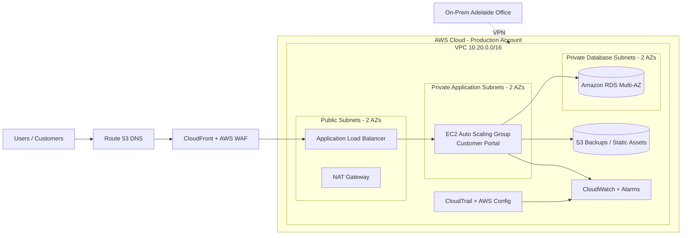

<a id="top"></a>

# ☁️ AWS Cloud Migration Starter Kit for a Small Business


> A practical, portfolio-ready cloud fundamentals and migration repository for a fictional Australian small business moving from on-premises infrastructure to AWS.

---

## Repository Purpose

This repository is designed for IT Support, System Administration, Junior Cloud, and Cloud Support candidates who want to demonstrate real-world cloud migration thinking.

It explains:

- Cloud computing basics
- AWS core services
- How a business prepares for cloud adoption
- How to design a secure AWS foundation
- How to migrate a simulated business workload
- How to build a VPC, public/private subnets, ALB, Auto Scaling, RDS, S3, monitoring, backup, and runbooks
- How to document decisions like a real IT project

---

## Fictional Business Scenario

**Company:** Southern Cross Office Supplies Pty Ltd  
**Location:** Adelaide, South Australia  
**Industry:** Retail and wholesale office supplies  
**Size:** 48 staff, 3 locations, 2 internal IT staff  
**Current Environment:** Small on-premises server room with Windows Server, file shares, customer portal, local database, backup NAS, VPN, and ageing hardware.

The business wants to move core services to AWS to improve:

- Availability
- Security
- Remote access
- Backup and disaster recovery
- Scalability during seasonal order spikes
- Cost visibility
- IT operational efficiency

Read the full scenario here: [Business Scenario](docs/business/scenario.md)

For the infographic-style learning page, see: [AWS Cloud Migration Deep Dive](docs/infographic/aws-cloud-migration-deep-dive.md)

---

## Target Cloud Architecture



Detailed design: [Target Architecture](docs/architecture/target-architecture.md)

---

## Repository Structure

```text
aws-cloud-migration-starter-kit-sme/
├── README.md
├── README-VI.md
├── assets/
│   └── aws-cloud-migration-overview.svg
├── docs/
│   ├── infographic/
│   ├── business/
│   ├── cloud-basics/
│   ├── architecture/
│   ├── migration/
│   ├── setup/
│   ├── security/
│   ├── operations/
│   ├── cost/
│   ├── runbooks/
│   ├── interview/
│   └── revision/
├── iac/
│   ├── terraform/
│   └── cloudformation/
├── sample-app/
├── scripts/
└── templates/
```

---

## Learning Path

| Step | Topic | Document |
|---|---|---|
| 1 | Cloud foundation | [Core Concepts](docs/cloud-basics/core-concepts.md) |
| 2 | Business context | [Business Scenario](docs/business/scenario.md) |
| 3 | Migration assessment | [Assessment Workbook](docs/migration/assessment-workbook.md) |
| 4 | Target design | [Target Architecture](docs/architecture/target-architecture.md) |
| 5 | AWS foundation setup | [Account & Landing Zone](docs/setup/01-account-landing-zone.md) |
| 6 | Identity & access | [IAM & Security Setup](docs/setup/02-iam-security.md) |
| 7 | Network setup | [VPC Setup](docs/setup/03-network-vpc.md) |
| 8 | Compute setup | [ALB & Auto Scaling](docs/setup/04-compute-alb-asg.md) |
| 9 | Data setup | [RDS & S3](docs/setup/05-rds-s3.md) |
| 10 | Monitoring | [Monitoring & Backup](docs/setup/06-monitoring-backup.md) |
| 10B | End-to-end setup | [Hands-On Lab](docs/setup/08-end-to-end-hands-on-lab.md) |
| 11 | Migration execution | [Migration Roadmap](docs/migration/migration-roadmap.md) |
| 12 | Operations | [Operational Checklist](docs/operations/operational-checklist.md) |
| 13 | Troubleshooting | [Troubleshooting Guide](docs/runbooks/troubleshooting-guide.md) |
| 14 | Interview prep | [Cloud Interview Questions](docs/interview/cloud-interview-questions.md) |

---

## Hands-On Build Summary

The core lab builds:

- One VPC across two Availability Zones
- Public subnets for ALB and NAT Gateway
- Private application subnets for EC2 Auto Scaling
- Private database subnets for RDS
- Internet Gateway and NAT Gateway routing
- Security Groups using least privilege
- Application Load Balancer
- Launch Template and Auto Scaling Group
- RDS database
- S3 bucket for backups and static files
- CloudWatch alarms and logs
- IAM roles for EC2 and operations
- Backup and disaster recovery runbooks

---

## Safe Deployment Warning

This repository is for learning and portfolio demonstration. Some resources may create real AWS costs, including NAT Gateway, Application Load Balancer, RDS, EC2, CloudWatch logs, and data transfer.

Before running any Infrastructure as Code:

1. Review all files.
2. Use a non-production AWS account.
3. Set an AWS Budget.
4. Use least-privilege IAM.
5. Destroy lab resources after testing.

---

## Quick Start

```bash
git clone https://github.com/your-username/aws-cloud-migration-starter-kit-sme.git
cd aws-cloud-migration-starter-kit-sme
```

For Terraform deployment:

```bash
cd iac/terraform
cp terraform.tfvars.example terraform.tfvars
terraform init
terraform plan
terraform apply
```

To remove the lab:

```bash
terraform destroy
```

---

## Best Portfolio Use

You can use this repository to show employers that you understand:

- Business-driven cloud migration
- AWS networking fundamentals
- Security baseline design
- High availability patterns
- Migration planning
- Troubleshooting
- Cost control
- Documentation standards
- Infrastructure as Code basics

---

## Author Branding

Created for IT Support / Cloud Support portfolio building.

**Hashtag:** `#ToanNguyenITOz`

[⬆ Back to Top](#top)
