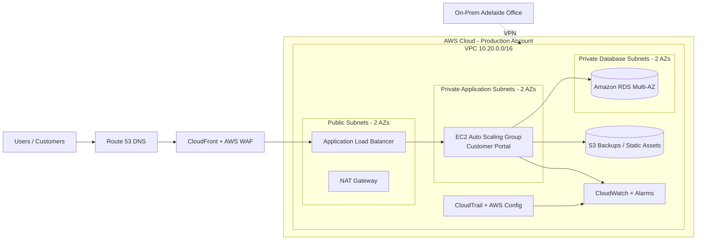

<a id="top"></a>

<p align="center">
  
</p>

# ☁️ AWS Cloud Migration Starter Kit for SMEs

<p align="center">
  
  
  
  
  
</p>

<p align="center">
  
  
  
  
  
  
  
  
</p>

<p align="center">
  <a href="README-VI.md">🇻🇳 Vietnamese Guide</a> •
  <a href="docs/setup/09-aws-console-manual-setup.md">🖱️ AWS Console Manual Setup</a> •
  <a href="docs/setup/10-aws-console-build-checklist.md">✅ Build Checklist</a> •
  <a href="iac/terraform/README.md">⚙️ Terraform Lab</a> •
  <a href="AUTHOR.md">👤 Author</a>
</p>

---

## 📌 Project Overview

This repository is a **portfolio-ready AWS cloud fundamentals and cloud migration project** for a simulated Australian small business moving from traditional on-premises infrastructure to AWS.

It is designed for learners and candidates preparing for roles in:

- IT Support
- Systems Administration
- Cloud Support
- Junior Cloud Engineering
- Infrastructure Support
- Junior DevOps

The project demonstrates how to plan, design, build, secure, monitor, troubleshoot and document a basic AWS cloud environment for a small-to-medium business.

---

## 🏢 Simulated Business Scenario

**Company:** Southern Cross Office Supplies Pty Ltd  
**Location:** Adelaide, South Australia  
**Industry:** Retail and wholesale office supplies  
**Size:** 48 staff, 3 locations, 2 internal IT staff  
**Current Environment:** Small on-premises server room with Windows Server, file shares, customer portal, local database, backup NAS, VPN and ageing hardware.

The business wants to move selected services to AWS to improve:

- Availability
- Security
- Remote access
- Backup and disaster recovery
- Scalability during seasonal order spikes
- Cost visibility
- IT operational efficiency

Read the full scenario: [docs/business/scenario.md](docs/business/scenario.md)

---

## 🧭 What This Repository Covers

| Area | Included Content |
|---|---|
| **Cloud Basics** | IaaS, PaaS, SaaS, public cloud, hybrid cloud, shared responsibility model |
| **Migration Planning** | Current-state assessment, migration waves, risk register, rollback plan |
| **Networking** | VPC, subnets, route tables, Internet Gateway, NAT Gateway, DNS basics |
| **Security** | IAM, MFA, least privilege, Security Groups, private subnets, audit logging |
| **Compute** | EC2, AMI, Launch Template, Application Load Balancer, Auto Scaling Group |
| **Database** | Amazon RDS private database design and basic validation |
| **Storage** | S3 backup bucket, encryption, versioning and lifecycle ideas |
| **Monitoring** | CloudWatch metrics, alarms, logs and operational checks |
| **Backup / DR** | Snapshot strategy, S3 protection, recovery planning and testing |
| **Operations** | Runbooks, troubleshooting guide, cutover checklist and rollback checklist |
| **IaC** | Terraform starter files and CloudFormation starter template |
| **Portfolio Evidence** | Screenshot checklist, documentation structure and interview talking points |

---

## 🏗️ Target AWS Architecture

<p align="center">
  
</p>



Detailed design: [docs/architecture/target-architecture.md](docs/architecture/target-architecture.md)

---

## 🚀 Deployment Options

This repo supports **three learning paths**.

| Option | Best For | Start Here |
|---|---|---|
| **A. Manual AWS Console** | Beginners, IT Support portfolio, interview preparation | [AWS Console Manual Setup](docs/setup/09-aws-console-manual-setup.md) |
| **B. Scripts** | Quick testing and repeatable small tasks | [scripts/](scripts/) |
| **C. Infrastructure as Code** | DevOps / Cloud Engineering practice | [Terraform](iac/terraform/README.md) and [CloudFormation](iac/cloudformation/network-foundation.yaml) |

Recommended learning order:

1. Read the business scenario.
2. Build manually in the AWS Console to understand every component.
3. Repeat selected tasks using scripts.
4. Rebuild the foundation using Terraform or CloudFormation.
5. Compare manual configuration with Infrastructure as Code.
6. Document screenshots, troubleshooting steps and lessons learned.

---

## 🖱️ Manual AWS Console Setup Guide

<p align="center">
  
</p>

This repository includes a full click-by-click guide for learners who want to configure the environment **directly in the AWS Management Console**, not only by scripts.

Start here: [docs/setup/09-aws-console-manual-setup.md](docs/setup/09-aws-console-manual-setup.md)

Use this checklist while building: [docs/setup/10-aws-console-build-checklist.md](docs/setup/10-aws-console-build-checklist.md)

### Manual Build Order

| Phase | AWS Service | What You Configure |
|---|---|---|
| 1 | Account / Billing | Region, MFA, budget alerts, project tags |
| 2 | VPC | VPC `10.20.0.0/16`, DNS hostnames, DNS resolution |
| 3 | Subnets | 2 public, 2 private app, 2 private DB subnets across 2 AZs |
| 4 | Internet Gateway | Public internet path for public subnets |
| 5 | NAT Gateway | Outbound internet access for private app instances |
| 6 | Route Tables | Public route to IGW, app route to NAT, DB route local only |
| 7 | Security Groups | ALB SG, App SG, RDS SG with least privilege rules |
| 8 | IAM | EC2 role for SSM, CloudWatch and limited S3 access |
| 9 | S3 | Private bucket, encryption, versioning, lifecycle rules |
| 10 | RDS | Private MySQL/MariaDB database in DB subnet group |
| 11 | EC2 Builder | Temporary web server to test app and RDS connectivity |
| 12 | AMI / Launch Template | Golden image or user-data based app deployment |
| 13 | Target Group | HTTP target group with `/health.html` health check |
| 14 | ALB | Internet-facing ALB in public subnets |
| 15 | Auto Scaling Group | Private EC2 instances across two AZs, desired/min/max capacity |
| 16 | CloudWatch | Metrics, alarms, logs and basic operations dashboard |
| 17 | Backup | RDS backups, snapshots, S3 protection and optional AWS Backup |
| 18 | Validation | ALB DNS, target health, RDS query, S3 upload and Auto Scaling test |
| 19 | Cutover Simulation | Simulate switching DNS to the new ALB endpoint |
| 20 | Cleanup | Remove billable resources safely |

---

## 🧪 Suggested Lab Values

| Component | Suggested Value |
|---|---|
| AWS Region | `ap-southeast-2` Sydney |
| VPC CIDR | `10.20.0.0/16` |
| Public Subnet A | `10.20.0.0/24` |
| Public Subnet B | `10.20.1.0/24` |
| Private App Subnet A | `10.20.10.0/24` |
| Private App Subnet B | `10.20.11.0/24` |
| Private DB Subnet A | `10.20.20.0/24` |
| Private DB Subnet B | `10.20.21.0/24` |
| App Port | HTTP `80` |
| DB Port | MySQL/MariaDB `3306` |
| Auto Scaling Desired / Min / Max | `2 / 2 / 4` |
| Health Check Path | `/health.html` |

---

## 🔐 Security Group Model

| Security Group | Inbound Rule | Source |
|---|---|---|
| `scos-dev-alb-sg` | HTTP 80 / HTTPS 443 | Internet or trusted IP range |
| `scos-dev-app-sg` | HTTP 80 | Only from `scos-dev-alb-sg` |
| `scos-dev-rds-sg` | MySQL/MariaDB 3306 | Only from `scos-dev-app-sg` |

> Recommended: use AWS Systems Manager Session Manager instead of opening SSH to the internet whenever possible.

---

## 📁 Repository Structure

```text
aws-cloud-migration-starter-kit-sme/
├── README.md
├── README-VI.md
├── AUTHOR.md
├── assets/
│   ├── aws-cloud-migration-banner.svg
│   ├── aws-cloud-migration-overview.svg
│   └── aws-console-manual-setup-flow.svg
├── docs/
│   ├── infographic/
│   ├── business/
│   ├── cloud-basics/
│   ├── architecture/
│   ├── migration/
│   ├── setup/
│   ├── security/
│   ├── operations/
│   ├── cost/
│   ├── runbooks/
│   ├── interview/
│   └── revision/
├── iac/
│   ├── terraform/
│   └── cloudformation/
├── sample-app/
├── scripts/
└── templates/
```

---

## 📚 Learning Path

| Step | Topic | Document |
|---|---|---|
| 1 | Cloud foundation | [Core Concepts](docs/cloud-basics/core-concepts.md) |
| 2 | Business context | [Business Scenario](docs/business/scenario.md) |
| 3 | Migration assessment | [Assessment Workbook](docs/migration/assessment-workbook.md) |
| 4 | Target design | [Target Architecture](docs/architecture/target-architecture.md) |
| 5 | AWS foundation setup | [Account & Landing Zone](docs/setup/01-account-landing-zone.md) |
| 6 | Identity & access | [IAM & Security Setup](docs/setup/02-iam-security.md) |
| 7 | Network setup | [VPC Setup](docs/setup/03-network-vpc.md) |
| 8 | Compute setup | [ALB & Auto Scaling](docs/setup/04-compute-alb-asg.md) |
| 9 | Data setup | [RDS & S3](docs/setup/05-rds-s3.md) |
| 10 | Monitoring | [Monitoring & Backup](docs/setup/06-monitoring-backup.md) |
| 11 | End-to-end setup | [Hands-On Lab](docs/setup/08-end-to-end-hands-on-lab.md) |
| 12 | Manual AWS Console setup | [AWS Console Manual Setup Guide](docs/setup/09-aws-console-manual-setup.md) |
| 13 | Evidence checklist | [AWS Console Build Checklist](docs/setup/10-aws-console-build-checklist.md) |
| 14 | Migration execution | [Migration Roadmap](docs/migration/migration-roadmap.md) |
| 15 | Operations | [Operational Checklist](docs/operations/operational-checklist.md) |
| 16 | Troubleshooting | [Troubleshooting Guide](docs/runbooks/troubleshooting-guide.md) |
| 17 | Interview prep | [Cloud Interview Questions](docs/interview/cloud-interview-questions.md) |

---

## ✅ Portfolio Evidence Checklist

Use this project to collect practical evidence for GitHub, LinkedIn and interviews.

- Architecture diagram screenshot
- VPC and subnet screenshot
- Route table screenshot
- Security Group screenshot
- S3 encryption/versioning screenshot
- RDS private subnet group screenshot
- EC2 builder test screenshot
- ALB target health screenshot
- Auto Scaling Group screenshot
- CloudWatch alarm screenshot
- Troubleshooting notes
- Cost cleanup confirmation

---

## 💼 Skills Demonstrated

<p align="center">
  
  
  
  
  
</p>

- Cloud migration planning
- AWS VPC design
- Public and private subnet segmentation
- IAM and Security Groups
- EC2 deployment and hardening basics
- Application Load Balancing
- Auto Scaling design
- RDS private database planning
- S3 backup and object storage
- CloudWatch monitoring and alarms
- Backup and disaster recovery planning
- Cost awareness and cleanup
- Infrastructure as Code fundamentals
- Technical documentation and runbook writing

---

## 👤 Author

**Xuan Toan Nguyen**  
IT Support & Systems Administration Candidate  
Adelaide, South Australia, Australia

20+ years of enterprise technology experience across banking IT, software support, IT operations, BI systems, remote technology support, automation and cloud/data projects.

Currently studying **Certificate IV in System Administration Support at TAFE SA**.

🥈 **Silver Medalist – WorldSkills Australia South Australian Regional Competition 2026 (Cloud Computing)**

- LinkedIn: [www.linkedin.com/in/toan-nguyen-it-oz](https://www.linkedin.com/in/toan-nguyen-it-oz)
- GitHub: [github.com/toannguyenitoz](https://github.com/toannguyenitoz)

---

## ⚠️ Important Security Notice

This repository is for learning and portfolio purposes only.

Never commit real secrets, passwords, private keys or customer data.

Do **not** upload:

```text
AWS Access Key
AWS Secret Key
.pem private key
RDS password
IAM credentials
Production database backup
Real customer information
Company confidential data
```

---

## 🧹 Cost Warning

Some AWS resources may create costs, especially:

- NAT Gateway
- Application Load Balancer
- EC2
- RDS
- CloudWatch logs
- Data transfer

Delete all lab resources after testing. Use the cleanup section in the manual guide and check AWS Billing afterwards.

---

## 📣 Final Message

Cloud migration is not only about moving servers.

It is about improving **security, scalability, reliability, backup, monitoring, cost visibility and business continuity**.

**Learn → Build → Document → Share**

<p align="center">
  <strong>#AWS #CloudComputing #CloudMigration #ITSupport #SysAdmin #ToanNguyenITOz</strong>
</p>

[⬆ Back to Top](#top)

---

<!-- PROJECT STANDARD FOOTER START -->

<p align="center">
  <a href="#top">⬆ Back to Top</a> •
  <a href="README.md">🏠 Home</a> •
  <a href="docs/README.md">📚 Documentation</a> •
  <a href="docs/setup/09-aws-console-manual-setup.md">🖱️ AWS Console Manual Setup</a> •
  <a href="AUTHOR.md">👤 Author</a>
</p>

<p align="center">
  <strong>AWS Cloud Migration Starter Kit for SMEs</strong><br>
  Created by <strong>Xuan Toan Nguyen</strong><br>
  IT Support &amp; Systems Administration Candidate — Adelaide, South Australia, Australia<br>
  <a href="https://www.linkedin.com/in/toan-nguyen-it-oz">LinkedIn</a> •
  <a href="https://github.com/toannguyenitoz">GitHub</a>
</p>

<p align="center">
  <em>Learn → Build → Document → Share</em><br>
  <strong>#ToanNguyenITOz</strong>
</p>

<!-- PROJECT STANDARD FOOTER END -->

