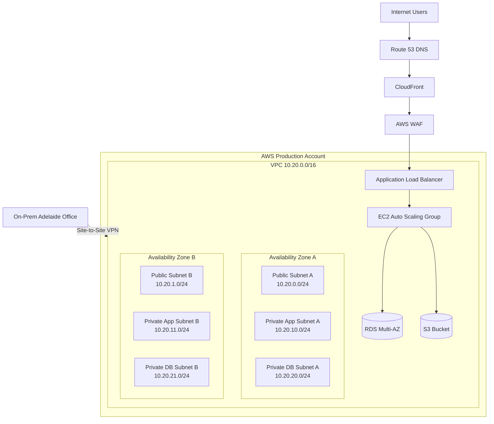

<!-- PROJECT STANDARD HEADER START -->

  

  
  
  
  

  <a href="../../README.md">🏠 Home</a> •
  <a href="../../docs/README.md">📚 Docs</a> •
  <a href="../../docs/setup/09-aws-console-manual-setup.md">🖱️ AWS Console Setup</a> •
  <a href="../../docs/setup/10-aws-console-build-checklist.md">✅ Checklist</a> •
  <a href="../../iac/terraform/README.md">⚙️ Terraform</a> •
  <a href="../../AUTHOR.md">👤 Author</a>

---

<!-- PROJECT STANDARD HEADER END -->

# Target AWS Architecture

## 1. Architecture Objective

The target architecture is designed for a small business moving a customer order portal to AWS.

The design focuses on:

- Clear network segmentation
- No direct public access to application or database servers
- Load balancing
- Auto Scaling
- Managed database
- Central logging
- Backup
- Cost visibility
- Simple operations for a small IT team

---

## 2. High-Level Architecture

---

## 3. Network Design

| Network Segment | CIDR | Purpose |
|---|---:|---|
| VPC | 10.20.0.0/16 | Main cloud network |
| Public Subnet A | 10.20.0.0/24 | ALB, NAT Gateway |
| Public Subnet B | 10.20.1.0/24 | ALB, optional NAT Gateway |
| Private App Subnet A | 10.20.10.0/24 | EC2 application instances |
| Private App Subnet B | 10.20.11.0/24 | EC2 application instances |
| Private DB Subnet A | 10.20.20.0/24 | RDS subnet group |
| Private DB Subnet B | 10.20.21.0/24 | RDS subnet group |
| Management Subnet A | 10.20.30.0/24 | Future admin tools |
| Management Subnet B | 10.20.31.0/24 | Future admin tools |

---

## 4. Routing Design

### Public Route Table

| Destination | Target |
|---|---|
| 10.20.0.0/16 | Local |
| 0.0.0.0/0 | Internet Gateway |

### Private Application Route Table

| Destination | Target |
|---|---|
| 10.20.0.0/16 | Local |
| 0.0.0.0/0 | NAT Gateway |

### Private Database Route Table

| Destination | Target |
|---|---|
| 10.20.0.0/16 | Local |

Database subnets do not require direct outbound internet access for this basic design.

---

## 5. Security Group Design

### ALB Security Group

| Direction | Protocol | Port | Source |
|---|---|---:|---|
| Inbound | TCP | 80 | 0.0.0.0/0 |
| Inbound | TCP | 443 | 0.0.0.0/0 |
| Outbound | TCP | App Port 80/443 | App Security Group |

### Application Security Group

| Direction | Protocol | Port | Source |
|---|---|---:|---|
| Inbound | TCP | 80 | ALB Security Group |
| Outbound | TCP | 3306/5432 | RDS Security Group |
| Outbound | HTTPS | 443 | AWS APIs / Internet via NAT |

### RDS Security Group

| Direction | Protocol | Port | Source |
|---|---|---:|---|
| Inbound | TCP | 3306 or 5432 | Application Security Group |
| Outbound | Default | Default | Default |

---

## 6. Data Architecture

| Data Type | Target |
|---|---|
| Application relational data | Amazon RDS |
| Product images | S3 |
| Reports | S3 |
| Application logs | CloudWatch Logs |
| Audit events | CloudTrail |
| Backups | AWS Backup + S3 |

---

## 7. Availability Design

| Layer | Availability Choice |
|---|---|
| Network | Two Availability Zones |
| Load Balancer | ALB across public subnets |
| Compute | Auto Scaling Group across private app subnets |
| Database | RDS Multi-AZ |
| Storage | S3 |
| Monitoring | CloudWatch alarms |
| Backup | Automated backup plan |

---

## 8. Future Improvements

After the first migration wave, the business can consider:

- Moving application from EC2 to containers using ECS or EKS
- Adding CI/CD pipeline
- Using Secrets Manager for database credentials
- Adding AWS Network Firewall for advanced inspection
- Implementing centralized multi-account landing zone
- Using AWS Backup cross-region copy
- Replacing legacy VPN with Zero Trust remote access pattern
- Adding Amazon QuickSight for reporting

[⬆ Back to Top](#top)

---

<!-- PROJECT STANDARD FOOTER START -->

  <a href="#top">⬆ Back to Top</a> •
  <a href="../../README.md">🏠 Home</a> •
  <a href="../../docs/README.md">📚 Documentation</a> •
  <a href="../../docs/setup/09-aws-console-manual-setup.md">🖱️ AWS Console Manual Setup</a> •
  <a href="../../AUTHOR.md">👤 Author</a>

  <strong>AWS Cloud Migration Starter Kit for SMEs</strong> 
  Created by <strong>Xuan Toan Nguyen</strong> 
  IT Support &amp; Systems Administration Candidate — Adelaide, South Australia, Australia 
  <a href="https://www.linkedin.com/in/toan-nguyen-it-oz">LinkedIn</a> •
  <a href="https://github.com/toannguyenitoz">GitHub</a>

  <em>Learn → Build → Document → Share</em> 
  <strong>#ToanNguyenITOz</strong>

<!-- PROJECT STANDARD FOOTER END -->

