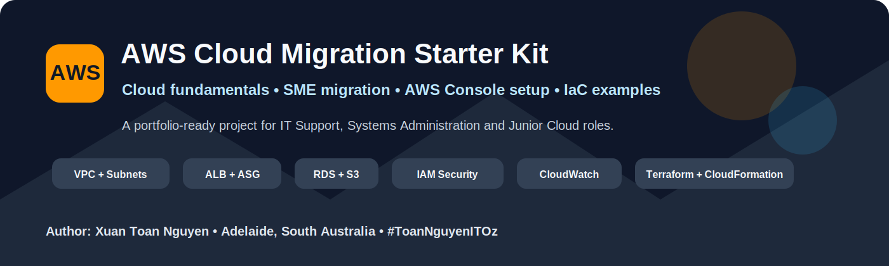

<!-- PROJECT STANDARD HEADER START -->

  

  
  
  
  

  <a href="../../README.md">🏠 Home</a> •
  <a href="../../docs/README.md">📚 Docs</a> •
  <a href="../../docs/setup/09-aws-console-manual-setup.md">🖱️ AWS Console Setup</a> •
  <a href="../../docs/setup/10-aws-console-build-checklist.md">✅ Checklist</a> •
  <a href="../../iac/terraform/README.md">⚙️ Terraform</a> •
  <a href="../../AUTHOR.md">👤 Author</a>

---

<!-- PROJECT STANDARD HEADER END -->

# Business Scenario: Southern Cross Office Supplies Pty Ltd

## 1. Company Overview

**Southern Cross Office Supplies Pty Ltd** is a fictional small-to-medium business based in Adelaide, South Australia.

The company sells office supplies to local businesses, schools, accountants, medical practices, and home-office customers.

### Business Profile

| Item | Detail |
|---|---|
| Business Name | Southern Cross Office Supplies Pty Ltd |
| Headquarters | Adelaide CBD |
| Branch Sites | Glenelg and Norwood |
| Staff Count | 48 |
| IT Team | 2 staff: IT Support Officer and Systems Administrator |
| Operating Hours | Monday to Saturday |
| Critical Systems | Customer portal, inventory database, file shares, email, VPN, reporting |
| Cloud Target | AWS |

---

## 2. Current On-Premises Environment

### Server Room

The company currently runs a small server room at the Adelaide office.

| System | Current State |
|---|---|
| Domain Controller | Windows Server 2016 |
| File Server | Windows Server VM with 2 TB of shared files |
| Web Server | IIS/PHP customer ordering portal |
| Database Server | MySQL on Windows VM |
| Backup | Local NAS and weekly USB rotation |
| Firewall | Small business firewall with site-to-site VPN |
| Remote Access | Legacy VPN client |
| Monitoring | Basic ping checks and manual review |
| Documentation | Incomplete and outdated |

---

## 3. Business Pain Points

### Availability

The customer ordering portal slows down during EOFY sales and back-to-school campaigns. If the Adelaide office loses power or internet, the portal may become unavailable.

### Security

The current environment has inconsistent patching, shared administrator accounts, weak audit logging, and limited visibility into remote access.

### Backup and Disaster Recovery

Backups exist, but restore testing is rare. There is no fully tested disaster recovery environment.

### Cost and Hardware

Physical hardware is close to end of life. Replacement would require new servers, licensing, storage, UPS, warranty, and installation time.

### Remote Work

Staff need better access to documents and applications without relying on a slow VPN.

---

## 4. Cloud Migration Goals

The business wants to achieve:

1. Improve customer portal availability.
2. Reduce dependency on office server room hardware.
3. Improve backup and restore capability.
4. Improve security logging and access control.
5. Enable scalable infrastructure for seasonal traffic.
6. Reduce manual maintenance.
7. Create a repeatable cloud foundation for future workloads.
8. Improve documentation for IT support handover.

---

## 5. Scope of the First Migration Wave

The first wave focuses on low-to-medium risk workloads.

| Workload | Migration Strategy | Target Service |
|---|---|---|
| Customer order portal | Replatform | EC2 Auto Scaling behind ALB |
| MySQL database | Replatform | Amazon RDS |
| Product images | Rehost / Replatform | Amazon S3 |
| Web server logs | Replatform | CloudWatch Logs |
| Backup archive | Replatform | S3 with lifecycle policy |
| Monitoring | New cloud capability | CloudWatch |
| Audit logging | New cloud capability | CloudTrail |

---

## 6. Out of Scope for First Wave

The following are not moved in the first phase:

- Active Directory domain controller
- Microsoft 365 / email
- POS terminals
- Finance system
- Printer management
- Branch network redesign

These may be reviewed in later phases.

---

## 7. Success Criteria

The migration project is considered successful when:

- Customer portal is accessible through a load balancer.
- Application servers are placed in private subnets.
- Database is not publicly accessible.
- RDS backup is enabled.
- S3 bucket blocks public access.
- CloudWatch alarms are configured.
- CloudTrail is enabled.
- A rollback plan exists.
- IT support can troubleshoot the common issues using runbooks.
- Monthly cost is reviewed after the pilot.

---

## 8. Stakeholders

| Role | Responsibility |
|---|---|
| Managing Director | Approves budget and business risk |
| Operations Manager | Confirms business downtime window |
| IT Support Officer | User communication and first-level support |
| Systems Administrator | AWS build, migration, monitoring |
| Web Developer | Application configuration and testing |
| Finance Officer | Cost review and invoice approval |
| External MSP | Escalation and security review |

---

## 9. Constraints

- Minimal downtime during business hours.
- Keep initial design simple enough for a small IT team.
- Avoid over-engineering.
- Keep the pilot close to Free Tier where practical, but do not compromise the security model.
- Use documentation that a future IT support engineer can understand.

---

## 10. Assumptions

- The business has permission to create AWS accounts.
- DNS records can be updated during the cutover window.
- Application code can connect to an RDS endpoint.
- Staff credentials and secrets are not stored in source code.
- The application can run on Linux or be packaged in a future container phase.

[⬆ Back to Top](#top)

---

<!-- PROJECT STANDARD FOOTER START -->

  <a href="#top">⬆ Back to Top</a> •
  <a href="../../README.md">🏠 Home</a> •
  <a href="../../docs/README.md">📚 Documentation</a> •
  <a href="../../docs/setup/09-aws-console-manual-setup.md">🖱️ AWS Console Manual Setup</a> •
  <a href="../../AUTHOR.md">👤 Author</a>

  <strong>AWS Cloud Migration Starter Kit for SMEs</strong> 
  Created by <strong>Xuan Toan Nguyen</strong> 
  IT Support &amp; Systems Administration Candidate — Adelaide, South Australia, Australia 
  <a href="https://www.linkedin.com/in/toan-nguyen-it-oz">LinkedIn</a> •
  <a href="https://github.com/toannguyenitoz">GitHub</a>

  <em>Learn → Build → Document → Share</em> 
  <strong>#ToanNguyenITOz</strong>

<!-- PROJECT STANDARD FOOTER END -->

