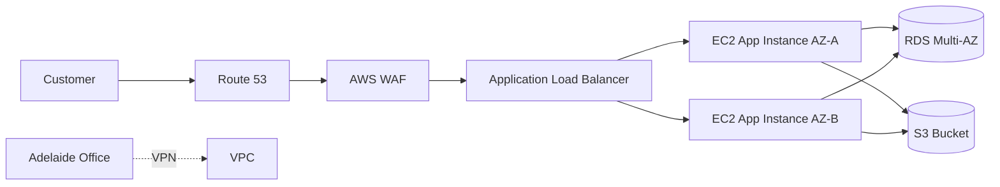

<!-- PROJECT STANDARD HEADER START -->

  

  
  
  
  

  <a href="../../README.md">🏠 Home</a> •
  <a href="../../docs/README.md">📚 Docs</a> •
  <a href="../../docs/setup/09-aws-console-manual-setup.md">🖱️ AWS Console Setup</a> •
  <a href="../../docs/setup/10-aws-console-build-checklist.md">✅ Checklist</a> •
  <a href="../../iac/terraform/README.md">⚙️ Terraform</a> •
  <a href="../../AUTHOR.md">👤 Author</a>

---

<!-- PROJECT STANDARD HEADER END -->

# AWS Cloud Migration - Introduction / Master Series #1

## AWS Cloud Foundation Deep Dive  
### Business Cloud Migration for a Simulated SME

---

## 1. Introduction / What Is It?

Cloud migration is the process of moving applications, data, servers, files, identity, and IT operations from an on-premises environment to a cloud platform.

In this project, the target platform is AWS.

For a small business, cloud migration is not just a technical move. It is a business improvement project that affects security, cost, backup, support, users, and operations.

**In simple words:**  
Cloud migration is like moving from a small server room in the office to a professionally managed digital data centre where resources can scale up, scale down, and be managed remotely.

---

## 2. Core Concepts

| Concept | Simple Meaning |
|---|---|
| Cloud Provider | The company providing cloud services, such as AWS |
| Region | A geographic area where cloud services run |
| Availability Zone | Separate data centre location inside a Region |
| VPC | Your private network inside AWS |
| Subnet | Smaller network segment inside a VPC |
| EC2 | Virtual server |
| RDS | Managed relational database |
| S3 | Object storage for files, backups, logs, and static assets |
| IAM | Identity and access control |
| Auto Scaling | Automatically adds or removes compute resources |
| Load Balancer | Distributes user traffic across servers |
| CloudWatch | Monitoring, logs, metrics, and alarms |
| CloudTrail | Audit history of API activity |

---

## 3. Business Scenario / Current State

**Southern Cross Office Supplies Pty Ltd** operates from Adelaide with two branch sites and one small server room.

Current systems:

- Windows Server Active Directory
- File server with about 2 TB of shared documents
- Customer order portal running on an ageing virtual machine
- MySQL database used by the customer portal
- Local backup NAS
- Remote access VPN for staff
- Manual patching
- Limited disaster recovery

Main problems:

- Hardware is close to end of life
- Website performance drops during seasonal sales
- Backup restore tests are rarely performed
- Remote access is slow
- No secondary site for disaster recovery
- IT team spends too much time maintaining infrastructure

---

## 4. Target Architecture / Flow

Traffic flow:

1. Users access the business website.
2. DNS resolves the business domain.
3. WAF filters malicious web requests.
4. Application Load Balancer sends traffic to healthy application servers.
5. EC2 Auto Scaling keeps the required number of servers running.
6. The application connects to RDS in private database subnets.
7. Files and backups are stored in S3.
8. CloudWatch monitors health, metrics, and logs.

---

## 5. Core AWS Components

| Component | Purpose |
|---|---|
| AWS Organizations | Account structure and governance |
| IAM Identity Center | Centralized workforce login |
| VPC | Private AWS network |
| Public Subnets | ALB, NAT Gateway, internet-facing components |
| Private App Subnets | Application servers with no direct public access |
| Private DB Subnets | RDS database layer |
| Internet Gateway | Internet access for public subnets |
| NAT Gateway | Outbound internet access for private resources |
| Security Groups | Stateful firewall rules |
| Network ACLs | Optional subnet-level traffic filtering |
| EC2 Auto Scaling | Automatic scaling and self-healing |
| ALB | HTTP/HTTPS load balancing |
| RDS Multi-AZ | Managed database availability |
| S3 | Durable object storage |
| CloudWatch | Logs, metrics, alarms |
| CloudTrail | API audit logging |
| AWS Backup | Centralized backup policy |

---

## 6. Migration Phases

| Phase | Goal | Key Outputs |
|---|---|---|
| Assess | Understand current systems | Inventory, risks, cost baseline |
| Mobilize | Prepare cloud foundation | Accounts, network, IAM, security baseline |
| Pilot | Move a low-risk workload | Proof of concept and lessons learned |
| Migrate | Move selected workloads | Wave plan, cutover, rollback |
| Optimize | Improve cost and operations | Monitoring, autoscaling, rightsizing |
| Modernize | Use cloud-native services | Managed databases, serverless, CI/CD |

---

## 7. Security / Best Practices

- Use separate AWS accounts for production, non-production, security, and logging.
- Enable MFA for privileged users.
- Use IAM roles instead of long-term access keys.
- Put application and database resources in private subnets.
- Allow inbound traffic only through the load balancer.
- Use Systems Manager Session Manager instead of public SSH where possible.
- Enable CloudTrail, AWS Config, GuardDuty, and VPC Flow Logs.
- Encrypt data at rest and in transit.
- Use least privilege for IAM policies and Security Groups.
- Review cost, security, and reliability regularly.

---

## 8. Troubleshooting Guide

| Problem | First Checks |
|---|---|
| Website not loading | DNS, ALB listener, target group health, Security Groups |
| EC2 cannot reach internet | NAT Gateway, route table, NACL, DNS |
| RDS connection failed | DB endpoint, port 3306/5432, Security Groups, DB subnet group |
| Auto Scaling not adding instances | CloudWatch alarm, scaling policy, launch template, capacity limits |
| High cost | NAT Gateway hours, RDS size, unattached EBS, idle EC2, logs retention |
| Staff cannot login | IAM Identity Center assignment, MFA, permission set, IdP status |
| Backup failed | Backup plan, vault permissions, resource tags, KMS key access |

---

## 9. Senior Interview Questions

| Question | Strong Answer |
|---|---|
| Why use private subnets? | To prevent direct internet exposure for app and database resources. |
| Why use ALB with Auto Scaling? | ALB distributes traffic to healthy instances while Auto Scaling adjusts capacity and replaces unhealthy instances. |
| What is the difference between Security Group and NACL? | Security Groups are stateful and attached to resources. NACLs are stateless and applied at subnet level. |
| Why use RDS instead of self-managed MySQL? | RDS reduces operational work for patching, backups, Multi-AZ availability, and monitoring. |
| What is the purpose of CloudTrail? | It records AWS API activity for auditing, investigation, and compliance. |
| What is the 7 Rs migration model? | A decision model for application migration strategy such as rehost, replatform, refactor, retire, and retain. |
| What is a rollback plan? | A documented plan to return service to the previous state if cutover fails. |

---

## 10. Quick Revision Notes

- VPC = private cloud network
- Subnet = smaller network inside VPC
- ALB = distributes HTTP/HTTPS traffic
- Auto Scaling = self-healing and scaling
- RDS = managed relational database
- S3 = object storage
- IAM = access control
- CloudWatch = monitoring
- CloudTrail = audit logs
- NAT Gateway = outbound internet for private subnets
- Security Group = stateful firewall
- Migration starts with assessment, not deployment

---

## 11. Key Takeaways

- A good cloud migration starts with business requirements.
- Do not move everything at once.
- Build the security baseline before moving workloads.
- Use private subnets for backend resources.
- Use managed services where possible.
- Monitor cost from day one.
- Test backup and rollback before cutover.
- Document everything.

---

**Secure Everything. Connect Anywhere. Build Cloud Networks with Confidence.**

[⬆ Back to Top](#top)

---

<!-- PROJECT STANDARD FOOTER START -->

  <a href="#top">⬆ Back to Top</a> •
  <a href="../../README.md">🏠 Home</a> •
  <a href="../../docs/README.md">📚 Documentation</a> •
  <a href="../../docs/setup/09-aws-console-manual-setup.md">🖱️ AWS Console Manual Setup</a> •
  <a href="../../AUTHOR.md">👤 Author</a>

  <strong>AWS Cloud Migration Starter Kit for SMEs</strong> 
  Created by <strong>Xuan Toan Nguyen</strong> 
  IT Support &amp; Systems Administration Candidate — Adelaide, South Australia, Australia 
  <a href="https://www.linkedin.com/in/toan-nguyen-it-oz">LinkedIn</a> •
  <a href="https://github.com/toannguyenitoz">GitHub</a>

  <em>Learn → Build → Document → Share</em> 
  <strong>#ToanNguyenITOz</strong>

<!-- PROJECT STANDARD FOOTER END -->

