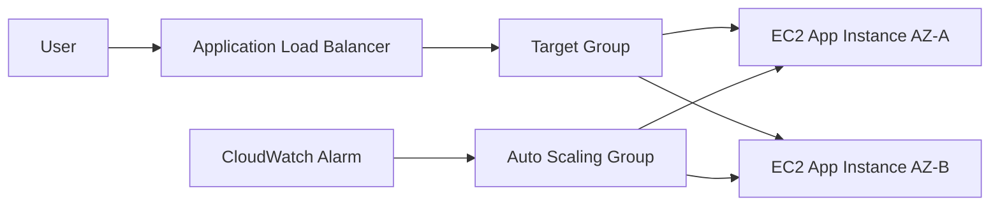

<a id="top"></a>

# Setup 04 - Application Load Balancer and Auto Scaling

## 1. Objective

Deploy a highly available application tier using:

- Application Load Balancer
- EC2 Launch Template
- Auto Scaling Group
- Target Group health checks
- CloudWatch scaling policy

---

## 2. Recommended Flow



---

## 3. Security Groups

### ALB Security Group

Inbound:

```text
HTTP 80 from 0.0.0.0/0
HTTPS 443 from 0.0.0.0/0
```

Outbound:

```text
HTTP 80 to Application Security Group
```

### App Security Group

Inbound:

```text
HTTP 80 from ALB Security Group
```

Outbound:

```text
HTTPS 443 to internet through NAT
DB port to RDS Security Group
```

---

## 4. Launch Template

Recommended settings:

| Setting | Value |
|---|---|
| Name | scos-prod-web-lt |
| AMI | Amazon Linux 2023 or approved company AMI |
| Instance Type | t3.micro for lab, rightsize for production |
| Key Pair | Avoid if using SSM; otherwise restricted key |
| Network | Private app subnets through ASG |
| IAM Role | EC2AppRole |
| Monitoring | Detailed monitoring optional |
| User Data | Install web server and app package |

Example user data is available here:

```text
scripts/ec2_user_data.sh
```

---

## 5. Target Group

| Setting | Value |
|---|---|
| Target Type | Instances |
| Protocol | HTTP |
| Port | 80 |
| Health Check Path | /health.html |
| Healthy Threshold | 2 |
| Unhealthy Threshold | 3 |

---

## 6. Application Load Balancer

| Setting | Value |
|---|---|
| Scheme | Internet-facing |
| Subnets | Public A and Public B |
| Listener | HTTP 80, HTTPS 443 later |
| Default Action | Forward to target group |

For production, use HTTPS with ACM certificate and redirect HTTP to HTTPS.

---

## 7. Auto Scaling Group

| Setting | Lab Value | Production Consideration |
|---|---:|---|
| Desired Capacity | 2 | Based on load test |
| Minimum Capacity | 2 | At least 2 for HA |
| Maximum Capacity | 4 | Based on budget and demand |
| Scaling Metric | Average CPU | Add request count and latency later |
| Target CPU | 60% | Tune after testing |

---

## 8. Validation

- Target group shows two healthy instances.
- ALB DNS name loads the web page.
- Stopping one instance causes Auto Scaling to replace it.
- CPU load test triggers scale-out.
- After load reduces, scale-in occurs.
- CloudWatch alarms record activity.

---

## 9. Troubleshooting

| Symptom | Check |
|---|---|
| ALB returns 503 | Target group has no healthy targets |
| Targets unhealthy | Health check path, app service, security group |
| EC2 not launching | Launch template, subnet capacity, IAM role |
| Scale-out not working | Scaling policy and CloudWatch alarm |
| App cannot reach DB | RDS endpoint, SG, route, credentials |

[⬆ Back to Top](#top)
