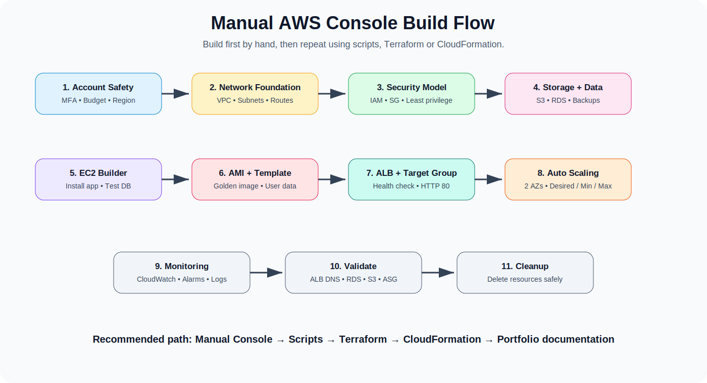
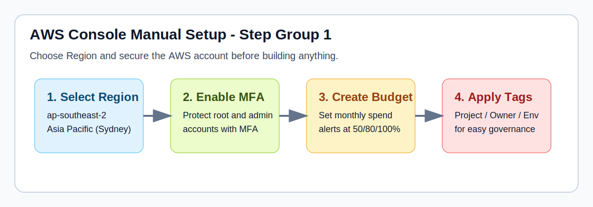
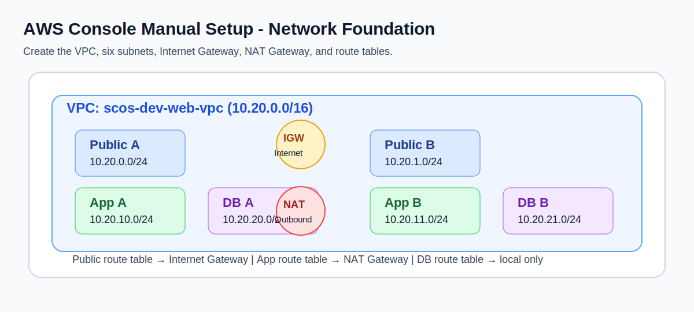
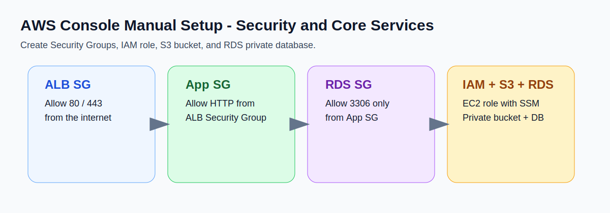
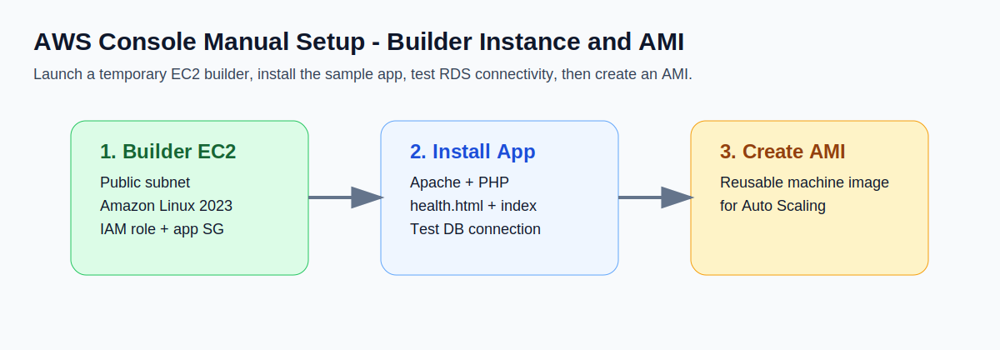
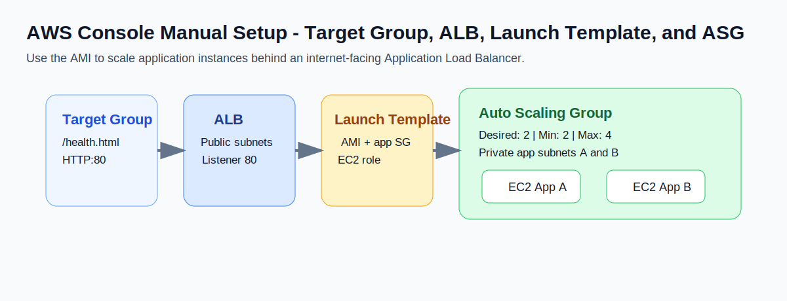

<a id="top"></a>

<!-- PROJECT STANDARD HEADER START -->

<p align="center">
  
</p>

<p align="center">
  
  
  
  
</p>

<p align="center">
  <a href="../../README.md">🏠 Home</a> •
  <a href="../../docs/README.md">📚 Docs</a> •
  <a href="../../docs/setup/09-aws-console-manual-setup.md">🖱️ AWS Console Setup</a> •
  <a href="../../docs/setup/10-aws-console-build-checklist.md">✅ Checklist</a> •
  <a href="../../iac/terraform/README.md">⚙️ Terraform</a> •
  <a href="../../AUTHOR.md">👤 Author</a>
</p>

---

<!-- PROJECT STANDARD HEADER END -->

# Setup 09 - AWS Console Manual Setup Guide

> This guide shows how to build the lab directly in the **AWS Management Console**. It is designed for learners who want to understand every AWS component before using scripts, Terraform, or CloudFormation.



## Quick Navigation

- [1. Goal](#1-goal)
- [2. Important Cost and Security Warning](#2-important-cost-and-security-warning)
- [3. Lab Assumptions](#3-lab-assumptions)
- [4. Target Architecture](#4-target-architecture)
- [5. Step 1 - Select Region](#5-step-1---select-region)
- [6. Step 2 - Account Safety Setup](#6-step-2---account-safety-setup)
- [7. Step 3 - Create the VPC](#7-step-3---create-the-vpc)
- [8. Step 4 - Create Subnets](#8-step-4---create-subnets)
- [9. Step 5 - Create Internet Gateway](#9-step-5---create-internet-gateway)
- [10. Step 6 - Create NAT Gateway](#10-step-6---create-nat-gateway)
- [11. Step 7 - Create Route Tables](#11-step-7---create-route-tables)
- [12. Step 8 - Create Security Groups](#12-step-8---create-security-groups)
- [13. Step 9 - Create IAM Role for EC2](#13-step-9---create-iam-role-for-ec2)
- [14. Step 10 - Create S3 Bucket](#14-step-10---create-s3-bucket)
- [15. Step 11 - Create RDS DB Subnet Group](#15-step-11---create-rds-db-subnet-group)
- [16. Step 12 - Create RDS Database](#16-step-12---create-rds-database)
- [17. Step 13 - Create a Temporary EC2 Builder Instance](#17-step-13---create-a-temporary-ec2-builder-instance)
- [18. Step 14 - Create an AMI from the Builder Instance](#18-step-14---create-an-ami-from-the-builder-instance)
- [19. Step 15 - Create Target Group](#19-step-15---create-target-group)
- [20. Step 16 - Create Application Load Balancer](#20-step-16---create-application-load-balancer)
- [21. Step 17 - Create Launch Template](#21-step-17---create-launch-template)
- [22. Step 18 - Create Auto Scaling Group](#22-step-18---create-auto-scaling-group)
- [23. Step 19 - Validate Load Balancing](#23-step-19---validate-load-balancing)
- [24. Step 20 - Test Auto Scaling](#24-step-20---test-auto-scaling)
- [25. Step 21 - Configure CloudWatch Alarms](#25-step-21---configure-cloudwatch-alarms)
- [26. Step 22 - Configure Backup](#26-step-22---configure-backup)
- [27. Step 23 - Optional DNS Cutover Simulation](#27-step-23---optional-dns-cutover-simulation)
- [28. Step 24 - Final Validation Checklist](#28-step-24---final-validation-checklist)
- [29. Common Troubleshooting](#29-common-troubleshooting)
- [30. Cleanup Order](#30-cleanup-order)
- [31. What to Document for Your Portfolio](#31-what-to-document-for-your-portfolio)
- [32. Next Step](#32-next-step)

---

## 1. Goal

Build a secure AWS environment for the fictional company:

**Southern Cross Office Supplies Pty Ltd**  
A small Adelaide-based business moving its customer portal, database, backups, and monitoring from on-premises infrastructure to AWS.

The manual build includes:

- AWS account safety setup
- VPC across two Availability Zones
- Public, private application, and private database subnets
- Internet Gateway
- NAT Gateway
- Route tables
- Security Groups
- IAM role for EC2
- S3 private bucket
- RDS private database
- EC2 test web server
- Application Load Balancer
- Target Group
- Launch Template
- Auto Scaling Group
- CloudWatch monitoring
- Backup and cleanup checklist


[⬆ Back to Top](#top)

---

## 2. Important Cost and Security Warning

This lab can create real AWS charges.

Resources that may cost money:

- NAT Gateway
- Elastic IP
- Application Load Balancer
- EC2 instances
- RDS database
- EBS volumes
- CloudWatch logs
- Snapshots
- Data transfer

Before you begin:

- Use a lab or non-production AWS account.
- Enable MFA.
- Create an AWS Budget.
- Do not use the root account for daily work.
- Do not commit passwords, access keys, private keys, or real business data to GitHub.
- Delete resources when you finish the lab.


[⬆ Back to Top](#top)

---

## 3. Lab Assumptions

| Item | Value |
|---|---|
| Region | `ap-southeast-2` Sydney |
| Environment | `dev` |
| Company short name | `scos` |
| Workload | `web` |
| VPC CIDR | `10.20.0.0/16` |
| Availability Zones | 2 |
| Database engine | MySQL or MariaDB |
| Web server OS | Amazon Linux 2023 |
| Web server package | Apache, PHP, MariaDB client |

Naming prefix:

```text
scos-dev-web
```

Example names:

```text
scos-dev-web-vpc
scos-dev-public-a
scos-dev-app-a
scos-dev-db-a
scos-dev-alb
scos-dev-asg
scos-dev-rds
```


[⬆ Back to Top](#top)

---

## 4. Target Architecture

```text
Internet Users
     |
     v
Route 53 / DNS
     |
     v
Application Load Balancer
     |
     v
Private EC2 Auto Scaling Group
     |
     v
Private RDS Database

Supporting services:
- S3 for backups and static files
- CloudWatch for metrics, logs, and alarms
- IAM for secure access
- NAT Gateway for private instance outbound updates
```

Network layout:

| Layer | Subnet | CIDR | Purpose |
|---|---|---:|---|
| Public | `scos-dev-public-a` | `10.20.0.0/24` | ALB, NAT Gateway |
| Public | `scos-dev-public-b` | `10.20.1.0/24` | ALB |
| Private App | `scos-dev-app-a` | `10.20.10.0/24` | EC2 app instances |
| Private App | `scos-dev-app-b` | `10.20.11.0/24` | EC2 app instances |
| Private DB | `scos-dev-db-a` | `10.20.20.0/24` | RDS subnet group |
| Private DB | `scos-dev-db-b` | `10.20.21.0/24` | RDS subnet group |


[⬆ Back to Top](#top)

---

## 5. Step 1 - Select Region




1. Sign in to the AWS Management Console.
2. In the top-right Region selector, choose:

```text
Asia Pacific (Sydney) ap-southeast-2
```

Sydney is used because the fictional company is based in Adelaide and this is a common Australian AWS Region for beginner labs.


[⬆ Back to Top](#top)

---

## 6. Step 2 - Account Safety Setup

> **Tip:** Complete MFA and Budget setup before you create cost-incurring resources such as NAT Gateway, ALB, and RDS.


### 6.1 Enable MFA

1. Open **IAM**.
2. Go to **Security credentials**.
3. Enable MFA for the root user and admin users.
4. Store recovery codes securely.

### 6.2 Create Budget

1. Open **Billing and Cost Management**.
2. Go to **Budgets**.
3. Choose **Create budget**.
4. Select **Cost budget**.
5. Example monthly budget:

```text
Budget name: scos-dev-monthly-budget
Amount: 20 AUD or your preferred lab limit
Alert threshold: 50%, 80%, 100%
Email: your email address
```

### 6.3 Recommended Tags

Use these tags on all resources:

| Key | Value |
|---|---|
| Project | CloudMigration |
| Environment | Dev |
| Owner | IT |
| Company | SCOS |
| CostCentre | Lab |


[⬆ Back to Top](#top)

---

## 7. Step 3 - Create the VPC




1. Open **VPC**.
2. Choose **Your VPCs**.
3. Choose **Create VPC**.
4. Select **VPC only**.
5. Configure:

```text
Name tag: scos-dev-web-vpc
IPv4 CIDR block: 10.20.0.0/16
IPv6 CIDR block: No IPv6 CIDR block
Tenancy: Default
```

6. Choose **Create VPC**.
7. Select the new VPC.
8. Choose **Actions > Edit VPC settings**.
9. Enable:

```text
DNS resolution: Enabled
DNS hostnames: Enabled
```


[⬆ Back to Top](#top)

---

## 8. Step 4 - Create Subnets

> **Tip:** Keep public, application, and database layers separated. This is one of the most important cloud design habits for beginners.


1. Open **VPC > Subnets**.
2. Choose **Create subnet**.
3. Select VPC:

```text
scos-dev-web-vpc
```

Create the following six subnets.

| Subnet name | Availability Zone | CIDR |
|---|---|---:|
| `scos-dev-public-a` | First AZ, for example `ap-southeast-2a` | `10.20.0.0/24` |
| `scos-dev-public-b` | Second AZ, for example `ap-southeast-2b` | `10.20.1.0/24` |
| `scos-dev-app-a` | First AZ | `10.20.10.0/24` |
| `scos-dev-app-b` | Second AZ | `10.20.11.0/24` |
| `scos-dev-db-a` | First AZ | `10.20.20.0/24` |
| `scos-dev-db-b` | Second AZ | `10.20.21.0/24` |

### 8.1 Enable Auto-Assign Public IPv4 for Public Subnets

For `scos-dev-public-a` and `scos-dev-public-b` only:

1. Select the subnet.
2. Choose **Actions > Edit subnet settings**.
3. Enable:

```text
Auto-assign public IPv4 address
```

Do not enable this for private app or private database subnets.


[⬆ Back to Top](#top)

---

## 9. Step 5 - Create Internet Gateway

1. Open **VPC > Internet gateways**.
2. Choose **Create internet gateway**.
3. Configure:

```text
Name tag: scos-dev-web-igw
```

4. Choose **Create internet gateway**.
5. Select the new gateway.
6. Choose **Actions > Attach to VPC**.
7. Select:

```text
scos-dev-web-vpc
```


[⬆ Back to Top](#top)

---

## 10. Step 6 - Create NAT Gateway

For a lab, one NAT Gateway is enough. For production, use one NAT Gateway per Availability Zone.

1. Open **VPC > NAT gateways**.
2. Choose **Create NAT gateway**.
3. Configure:

```text
Name: scos-dev-web-nat-a
Subnet: scos-dev-public-a
Connectivity type: Public
Elastic IP allocation ID: Allocate Elastic IP
```

4. Choose **Create NAT gateway**.
5. Wait until the NAT Gateway status becomes **Available**.


[⬆ Back to Top](#top)

---

## 11. Step 7 - Create Route Tables

### 11.1 Public Route Table

1. Open **VPC > Route tables**.
2. Choose **Create route table**.
3. Configure:

```text
Name: scos-dev-public-rt
VPC: scos-dev-web-vpc
```

4. Open the route table.
5. Go to **Routes > Edit routes**.
6. Add:

```text
Destination: 0.0.0.0/0
Target: Internet Gateway scos-dev-web-igw
```

7. Go to **Subnet associations**.
8. Associate:

```text
scos-dev-public-a
scos-dev-public-b
```

### 11.2 Private Application Route Table

1. Create route table:

```text
Name: scos-dev-app-rt
VPC: scos-dev-web-vpc
```

2. Add route:

```text
Destination: 0.0.0.0/0
Target: NAT Gateway scos-dev-web-nat-a
```

3. Associate:

```text
scos-dev-app-a
scos-dev-app-b
```

### 11.3 Private Database Route Table

1. Create route table:

```text
Name: scos-dev-db-rt
VPC: scos-dev-web-vpc
```

2. Do not add internet route.
3. Keep only local VPC route.
4. Associate:

```text
scos-dev-db-a
scos-dev-db-b
```


[⬆ Back to Top](#top)

---

## 12. Step 8 - Create Security Groups




Open **EC2 > Security Groups** or **VPC > Security Groups**.

### 12.1 ALB Security Group

Create:

```text
Name: scos-dev-alb-sg
Description: Allow public web traffic to ALB
VPC: scos-dev-web-vpc
```

Inbound rules:

| Type | Protocol | Port | Source |
|---|---|---:|---|
| HTTP | TCP | 80 | `0.0.0.0/0` |
| HTTPS | TCP | 443 | `0.0.0.0/0` |

For a lab without SSL, HTTP is enough. For production, use HTTPS with ACM certificate.

Outbound:

```text
Allow all outbound
```

### 12.2 Application Security Group

Create:

```text
Name: scos-dev-app-sg
Description: Allow web traffic from ALB to app instances
VPC: scos-dev-web-vpc
```

Inbound rules:

| Type | Protocol | Port | Source |
|---|---|---:|---|
| HTTP | TCP | 80 | `scos-dev-alb-sg` |

Optional temporary SSH rule for lab only:

| Type | Protocol | Port | Source |
|---|---|---:|---|
| SSH | TCP | 22 | Your public IP only |

Preferred access method:

```text
Use AWS Systems Manager Session Manager instead of opening SSH to the internet.
```

Outbound:

```text
Allow all outbound
```

### 12.3 RDS Security Group

Create:

```text
Name: scos-dev-rds-sg
Description: Allow database access only from app instances
VPC: scos-dev-web-vpc
```

Inbound rules for MySQL or MariaDB:

| Type | Protocol | Port | Source |
|---|---|---:|---|
| MySQL/Aurora | TCP | 3306 | `scos-dev-app-sg` |

Outbound:

```text
Allow all outbound
```


[⬆ Back to Top](#top)

---

## 13. Step 9 - Create IAM Role for EC2

1. Open **IAM > Roles**.
2. Choose **Create role**.
3. Trusted entity type:

```text
AWS service
```

4. Use case:

```text
EC2
```

5. Attach policies for lab:

```text
AmazonSSMManagedInstanceCore
CloudWatchAgentServerPolicy
```

6. For S3 access, create a least-privilege custom policy later. For beginner lab testing, you can temporarily attach a limited project-specific S3 policy.
7. Name the role:

```text
scos-dev-ec2-app-role
```

8. Create role.


[⬆ Back to Top](#top)

---

## 14. Step 10 - Create S3 Bucket

1. Open **S3**.
2. Choose **Create bucket**.
3. Bucket name must be globally unique. Example:

```text
scos-dev-backup-assets-yourinitials
```

4. Region:

```text
ap-southeast-2
```

5. Object Ownership:

```text
ACLs disabled
```

6. Block Public Access:

```text
Block all public access: Enabled
```

7. Bucket Versioning:

```text
Enabled
```

8. Default encryption:

```text
SSE-S3 or SSE-KMS
```

9. Choose **Create bucket**.

### 14.1 Create Folder Structure

Inside the bucket, create folders:

```text
app-assets/
backups/
logs/
test-uploads/
```

### 14.2 Add Lifecycle Rule

1. Open the bucket.
2. Go to **Management > Lifecycle rules**.
3. Choose **Create lifecycle rule**.
4. Example rule:

```text
Rule name: scos-dev-backup-lifecycle
Scope: backups/
Move current versions to Standard-IA after 30 days
Move current versions to Glacier Instant Retrieval or Deep Archive after 90 days
Expire old noncurrent versions after 365 days
```


[⬆ Back to Top](#top)

---

## 15. Step 11 - Create RDS DB Subnet Group

1. Open **RDS**.
2. Go to **Subnet groups**.
3. Choose **Create DB subnet group**.
4. Configure:

```text
Name: scos-dev-db-subnet-group
Description: Private DB subnets for SCOS dev database
VPC: scos-dev-web-vpc
```

5. Select two Availability Zones.
6. Add subnets:

```text
scos-dev-db-a
scos-dev-db-b
```

7. Choose **Create**.


[⬆ Back to Top](#top)

---

## 16. Step 12 - Create RDS Database

> **Tip:** For a portfolio lab, use a low-cost instance class and remember that Multi-AZ, storage, and backup retention can increase cost.


1. Open **RDS > Databases**.
2. Choose **Create database**.
3. Choose creation method:

```text
Standard create
```

4. Engine options:

```text
MySQL or MariaDB
```

5. Templates:

```text
Dev/Test for lab
Production for real workloads
```

6. Availability:

```text
Single DB instance for low-cost lab
Multi-AZ for production-style demonstration if cost is acceptable
```

7. Settings:

```text
DB instance identifier: scos-dev-rds
Master username: admin
Password: use a strong password and store it securely
```

8. Instance configuration:

```text
Burstable class, for example db.t3.micro or current free-tier eligible option if available
```

9. Storage:

```text
Allocated storage: 20 GiB for lab
Storage autoscaling: Optional
Encryption: Enabled
```

10. Connectivity:

```text
VPC: scos-dev-web-vpc
DB subnet group: scos-dev-db-subnet-group
Public access: No
VPC security group: scos-dev-rds-sg
Database port: 3306
```

11. Additional configuration:

```text
Initial database name: scosapp
Backup retention: 7 days for lab
Enhanced monitoring: Optional
Deletion protection: Enabled for production, optional for lab
```

12. Choose **Create database**.
13. Wait until status is **Available**.
14. Copy the RDS endpoint for later testing.


[⬆ Back to Top](#top)

---

## 17. Step 13 - Create a Temporary EC2 Builder Instance




This step creates a temporary EC2 instance used to install the sample web application and create an AMI.

Alternative: You can skip the AMI approach and use Launch Template user data, but this section focuses on manual console learning.

1. Open **EC2 > Instances**.
2. Choose **Launch instances**.
3. Configure:

```text
Name: scos-dev-web-builder
AMI: Amazon Linux 2023
Instance type: t3.micro or free-tier eligible option
Key pair: Choose existing key pair or create one for lab
Network: scos-dev-web-vpc
Subnet: scos-dev-public-a for easier first-time access
Auto-assign public IP: Enabled
Security group: scos-dev-app-sg
IAM instance profile: scos-dev-ec2-app-role
```

4. Storage:

```text
8 GiB gp3 is enough for lab
```

5. Launch instance.

### 17.1 Connect to Builder Instance

Preferred:

```text
EC2 Instance Connect or Session Manager
```

If using SSH:

```bash
ssh -i your-key.pem ec2-user@<public-ip>
```

### 17.2 Install Web Packages Manually

Run:

```bash
sudo dnf update -y
sudo dnf install -y httpd php php-mysqli mariadb105
sudo systemctl enable --now httpd
```

Create a health check file:

```bash
echo "OK" | sudo tee /var/www/html/health.html
```

Create a simple test page:

```bash
cat <<'HTML' | sudo tee /var/www/html/index.html
<!doctype html>
<html>
<head><title>SCOS Cloud Migration Lab</title></head>
<body>
<h1>Southern Cross Office Supplies - AWS Cloud Migration Lab</h1>
<p>Application server is running.</p>
</body>
</html>
HTML
```

Test locally:

```bash
curl http://localhost/health.html
curl http://localhost/
```

### 17.3 Test RDS Connection from EC2

Use the RDS endpoint copied earlier:

```bash
mysql -h <rds-endpoint> -P 3306 -u admin -p
```

After login, run:

```sql
CREATE DATABASE IF NOT EXISTS scosapp;
USE scosapp;
CREATE TABLE IF NOT EXISTS products (
  id INT AUTO_INCREMENT PRIMARY KEY,
  product_name VARCHAR(100),
  category VARCHAR(50),
  stock_qty INT
);
INSERT INTO products (product_name, category, stock_qty)
VALUES
('Printer Paper A4', 'Paper', 150),
('Blue Ballpoint Pen', 'Stationery', 500),
('Office Chair', 'Furniture', 20);
SELECT * FROM products;
```

Exit:

```sql
exit;
```

If the connection fails, check:

- RDS is available.
- RDS public access is set to No.
- RDS Security Group allows port 3306 from app SG.
- EC2 is using the correct app Security Group.
- Subnets and route tables are correct.
- Username, password, and endpoint are correct.


[⬆ Back to Top](#top)

---

## 18. Step 14 - Create an AMI from the Builder Instance

1. Open **EC2 > Instances**.
2. Select:

```text
scos-dev-web-builder
```

3. Choose **Actions > Image and templates > Create image**.
4. Configure:

```text
Image name: scos-dev-web-ami
Image description: SCOS dev web server image with Apache and sample app
No reboot: Disabled for cleaner image
```

5. Choose **Create image**.
6. Wait until AMI status is **Available** under **EC2 > AMIs**.


[⬆ Back to Top](#top)

---

## 19. Step 15 - Create Target Group




1. Open **EC2 > Target Groups**.
2. Choose **Create target group**.
3. Configure:

```text
Target type: Instances
Target group name: scos-dev-web-tg
Protocol: HTTP
Port: 80
VPC: scos-dev-web-vpc
Protocol version: HTTP1
```

4. Health checks:

```text
Health check protocol: HTTP
Health check path: /health.html
Healthy threshold: 2
Unhealthy threshold: 2
Timeout: 5 seconds
Interval: 30 seconds
Success codes: 200
```

5. Do not manually register targets if the Auto Scaling Group will do it.
6. Create target group.


[⬆ Back to Top](#top)

---

## 20. Step 16 - Create Application Load Balancer

1. Open **EC2 > Load Balancers**.
2. Choose **Create load balancer**.
3. Select **Application Load Balancer**.
4. Configure:

```text
Load balancer name: scos-dev-web-alb
Scheme: Internet-facing
IP address type: IPv4
```

5. Network mapping:

```text
VPC: scos-dev-web-vpc
Mappings: scos-dev-public-a and scos-dev-public-b
```

6. Security group:

```text
scos-dev-alb-sg
```

7. Listener:

```text
Protocol: HTTP
Port: 80
Default action: Forward to scos-dev-web-tg
```

8. Create load balancer.
9. Wait until state is **Active**.


[⬆ Back to Top](#top)

---

## 21. Step 17 - Create Launch Template

1. Open **EC2 > Launch Templates**.
2. Choose **Create launch template**.
3. Configure:

```text
Launch template name: scos-dev-web-lt
Template version description: Initial manual console build
Auto Scaling guidance: Enabled if available
```

4. Application and OS Images:

```text
My AMIs: scos-dev-web-ami
```

5. Instance type:

```text
t3.micro or suitable lab instance type
```

6. Key pair:

```text
Choose key pair only if SSH is required
```

7. Network settings:

```text
Do not specify subnet here. Auto Scaling Group will choose private app subnets.
Security group: scos-dev-app-sg
```

8. IAM instance profile:

```text
scos-dev-ec2-app-role
```

9. Advanced details:

```text
Detailed CloudWatch monitoring: Optional
Metadata version: Require IMDSv2 if available
```

10. Create launch template.


[⬆ Back to Top](#top)

---

## 22. Step 18 - Create Auto Scaling Group

1. Open **EC2 > Auto Scaling Groups**.
2. Choose **Create Auto Scaling group**.
3. Configure:

```text
Auto Scaling group name: scos-dev-web-asg
Launch template: scos-dev-web-lt
```

4. Network:

```text
VPC: scos-dev-web-vpc
Availability Zones and subnets: scos-dev-app-a and scos-dev-app-b
```

5. Load balancing:

```text
Attach to an existing load balancer
Choose from your load balancer target groups
Target group: scos-dev-web-tg
Health checks: Turn on ELB health checks
Health check grace period: 300 seconds
```

6. Group size:

```text
Desired capacity: 2
Minimum capacity: 2
Maximum capacity: 4
```

7. Scaling policy:

```text
Target tracking scaling policy
Metric type: Average CPU utilization
Target value: 60
```

8. Notifications:

```text
Optional for lab
```

9. Tags:

| Key | Value | Propagate to instances |
|---|---|---|
| Name | `scos-dev-web-asg-instance` | Yes |
| Project | `CloudMigration` | Yes |
| Environment | `Dev` | Yes |

10. Review and create Auto Scaling Group.
11. Wait until two instances launch.


[⬆ Back to Top](#top)

---

## 23. Step 19 - Validate Load Balancing


### 23.1 Check Target Health

1. Open **EC2 > Target Groups**.
2. Select:

```text
scos-dev-web-tg
```

3. Go to **Targets**.
4. Confirm both instances are:

```text
Healthy
```

If unhealthy, check:

- `/health.html` exists.
- Apache/httpd is running.
- App Security Group allows HTTP from ALB Security Group.
- ALB target group uses port 80.
- Instances are in private app subnets.
- Route table allows outbound access through NAT Gateway.

### 23.2 Test ALB DNS

1. Open **EC2 > Load Balancers**.
2. Select:

```text
scos-dev-web-alb
```

3. Copy **DNS name**.
4. Open in browser:

```text
http://<alb-dns-name>
```

Expected result:

```text
Southern Cross Office Supplies - AWS Cloud Migration Lab
Application server is running.
```


[⬆ Back to Top](#top)

---

## 24. Step 20 - Test Auto Scaling

> **Tip:** For a learner lab, manually changing the desired capacity is the safest way to demonstrate scaling without generating unnecessary load or surprise cost.


For a safe beginner test, avoid aggressive load testing.

Option A - Manual observation:

1. Open **EC2 > Auto Scaling Groups**.
2. Select `scos-dev-web-asg`.
3. Temporarily change desired capacity from 2 to 3.
4. Confirm one new instance is created.
5. Change desired capacity back to 2.
6. Confirm the extra instance is terminated.

Option B - CPU-based test:

1. Connect to one app instance using Session Manager.
2. Run a short CPU load command only in a lab environment.
3. Watch CloudWatch metric and ASG activity.
4. Stop the load quickly.

Do not run uncontrolled stress tests on production accounts.


[⬆ Back to Top](#top)

---

## 25. Step 21 - Configure CloudWatch Alarms

Open **CloudWatch > Alarms > Create alarm**.

Recommended alarms:

| Alarm | Metric | Example Threshold |
|---|---|---:|
| ALB unhealthy hosts | `UnHealthyHostCount` | `>= 1` |
| ALB 5XX errors | `HTTPCode_ELB_5XX_Count` | `> 10` in 5 minutes |
| Target 5XX errors | `HTTPCode_Target_5XX_Count` | `> 10` in 5 minutes |
| EC2 CPU high | `CPUUtilization` | `> 80%` for 10 minutes |
| RDS CPU high | `CPUUtilization` | `> 80%` for 10 minutes |
| RDS free storage low | `FreeStorageSpace` | Business-defined threshold |
| Estimated charges | Billing metric | `> budget threshold` |

For notifications:

1. Create or select an SNS topic.
2. Subscribe your email.
3. Confirm subscription from your inbox.


[⬆ Back to Top](#top)

---

## 26. Step 22 - Configure Backup

### 26.1 RDS Backups

When creating RDS, enable:

```text
Automated backups: Enabled
Retention: 7 days for lab, longer for production
Backup window: Low-traffic period
Copy tags to snapshots: Enabled
```

Manual snapshot:

1. Open **RDS > Databases**.
2. Select `scos-dev-rds`.
3. Choose **Actions > Take snapshot**.
4. Name:

```text
scos-dev-rds-manual-snapshot-YYYYMMDD
```

### 26.2 S3 Protection

Enable:

```text
Versioning
Default encryption
Lifecycle rules
Block Public Access
```

### 26.3 AWS Backup Optional Plan

1. Open **AWS Backup**.
2. Create backup plan:

```text
Name: scos-dev-backup-plan
Frequency: Daily
Retention: 14 or 30 days for lab
Resources: RDS and selected EBS volumes
```


[⬆ Back to Top](#top)

---

## 27. Step 23 - Optional DNS Cutover Simulation

For a real business migration, DNS cutover points users from the old system to the cloud system.

For a lab:

1. Do not change a real production domain.
2. Use a test domain or local hosts file.
3. Confirm ALB is working.
4. Lower DNS TTL before migration in real scenarios.
5. Keep rollback record documented.

Example records:

| Record | Target |
|---|---|
| `portal-test.example.com` | ALB DNS name |
| `old-portal.example.com` | Old on-premises endpoint |


[⬆ Back to Top](#top)

---

## 28. Step 24 - Final Validation Checklist

| Check | Expected Result |
|---|---|
| VPC exists | `10.20.0.0/16` |
| Public subnets | 2 subnets across 2 AZs |
| Private app subnets | 2 subnets across 2 AZs |
| Private DB subnets | 2 subnets across 2 AZs |
| Public route table | `0.0.0.0/0` to Internet Gateway |
| App route table | `0.0.0.0/0` to NAT Gateway |
| DB route table | No internet route |
| ALB SG | HTTP/HTTPS from internet |
| App SG | HTTP only from ALB SG |
| RDS SG | DB port only from App SG |
| RDS public access | No |
| ASG desired capacity | 2 |
| Target group health | Healthy |
| ALB URL | Loads app page |
| CloudWatch alarms | Created |
| S3 bucket | Private, encrypted, versioned |
| Budget | Created |
| Cleanup plan | Documented |


[⬆ Back to Top](#top)

---

## 29. Common Troubleshooting

| Problem | Likely Cause | Fix |
|---|---|---|
| ALB DNS does not load | Target unhealthy, wrong SG, app not running | Check target health, Security Groups, Apache service |
| Target group unhealthy | Health check path missing | Confirm `/health.html` exists and returns HTTP 200 |
| EC2 cannot install packages | Private subnet has no NAT route | Check NAT Gateway and private route table |
| EC2 cannot connect to RDS | RDS SG or wrong endpoint | Allow 3306 from app SG and verify endpoint |
| RDS accidentally public | Public access set to Yes | Modify DB and set Public access to No |
| Browser timeout | ALB SG missing inbound 80 | Add HTTP 80 from internet for lab |
| ASG launches but terminates instances | Failed health check | Check Apache, health path, SG, instance boot logs |
| S3 access denied | IAM role missing bucket permissions | Add least-privilege S3 policy to EC2 role |
| Costs increasing | NAT Gateway, ALB, RDS still running | Delete lab resources after testing |


[⬆ Back to Top](#top)

---

## 30. Cleanup Order

Delete resources in this order to avoid dependency errors and ongoing costs:

1. Auto Scaling Group
2. EC2 instances not managed by ASG
3. Launch Template if no longer needed
4. Application Load Balancer
5. Target Group
6. RDS database
7. RDS snapshots not required
8. S3 objects and bucket
9. NAT Gateway
10. Elastic IP released from NAT Gateway
11. Route tables created for lab
12. Subnets
13. Internet Gateway detach and delete
14. VPC
15. CloudWatch alarms and log groups if not needed
16. IAM roles and policies created for the lab

Important:

```text
Deleting the NAT Gateway does not always release the Elastic IP automatically.
Check Elastic IPs and release unused addresses.
```


[⬆ Back to Top](#top)

---

## 31. What to Document for Your Portfolio

Take screenshots of:

- VPC and subnet list
- Route tables
- Security Groups
- RDS private configuration
- S3 bucket security settings
- ALB listener and target group
- Target group healthy instances
- Auto Scaling Group desired/min/max capacity
- CloudWatch alarms
- ALB web page working
- RDS test query result

Write a short summary:

```text
I designed and manually configured a three-tier AWS architecture for a simulated Adelaide-based SME. The environment used a segmented VPC, public and private subnets, ALB, EC2 Auto Scaling, private RDS, S3 backup storage, IAM roles, CloudWatch monitoring, and cost controls. I then compared the manual deployment with script/IaC approaches to improve repeatability.
```


[⬆ Back to Top](#top)

---

## 32. Next Step

After you finish the manual console build, repeat the same design using:

- `scripts/`
- `iac/terraform/`
- `iac/cloudformation/`

This helps you understand the difference between manual administration and repeatable Infrastructure as Code.

[⬆ Back to Top](#top)

---

<!-- PROJECT STANDARD FOOTER START -->

<p align="center">
  <a href="#top">⬆ Back to Top</a> •
  <a href="../../README.md">🏠 Home</a> •
  <a href="../../docs/README.md">📚 Documentation</a> •
  <a href="../../docs/setup/09-aws-console-manual-setup.md">🖱️ AWS Console Manual Setup</a> •
  <a href="../../AUTHOR.md">👤 Author</a>
</p>

<p align="center">
  <strong>AWS Cloud Migration Starter Kit for SMEs</strong><br>
  Created by <strong>Xuan Toan Nguyen</strong><br>
  IT Support &amp; Systems Administration Candidate — Adelaide, South Australia, Australia<br>
  <a href="https://www.linkedin.com/in/toan-nguyen-it-oz">LinkedIn</a> •
  <a href="https://github.com/toannguyenitoz">GitHub</a>
</p>

<p align="center">
  <em>Learn → Build → Document → Share</em><br>
  <strong>#ToanNguyenITOz</strong>
</p>

<!-- PROJECT STANDARD FOOTER END -->

